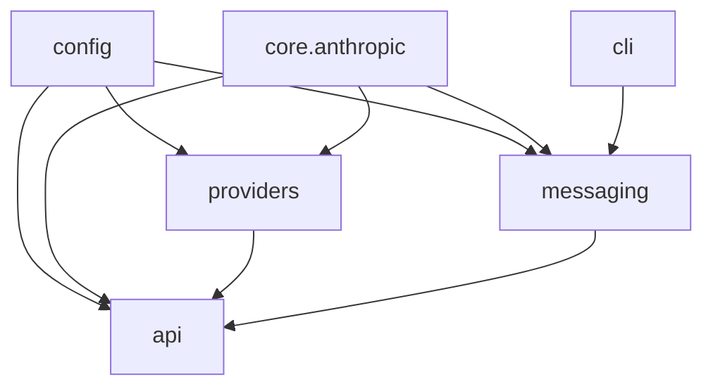

# Architecture Plan

This document is the baseline architecture guide referenced by `AGENTS.md` and
`CLAUDE.md`. It records the intended dependency direction and the migration
target for keeping the project modular as providers, clients, and smoke tests
grow.

## Current Product Shape

`free-claude-code` is an Anthropic-compatible proxy with optional messaging
workers:

- `api/` owns the HTTP routes, request orchestration, model routing, auth, and
  server lifecycle.
- `providers/` owns upstream model adapters, request conversion, stream
  conversion, provider rate limiting, and provider error mapping.
- `messaging/` owns Discord and Telegram adapters, command handling, tree
  threading, session persistence, transcript rendering, and voice intake.
- `cli/` owns package entrypoints and managed Claude CLI subprocess sessions.
- `config/` owns environment-backed settings and logging setup.
- `smoke/` owns opt-in product smoke scenarios and the public coverage
  inventory used by contract tests.

## Intended Dependency Direction

The repo should preserve this dependency order:

The practical rule is simpler than the graph: shared protocol helpers belong in
neutral core modules, not under a provider package. Provider adapters may depend
on the neutral protocol layer, but API and messaging code should not import
provider internals.

## Target Boundaries

- `core/anthropic/`: Anthropic protocol helpers, stream primitives, content
  extraction, token estimation, user-facing error strings, and request
  conversion utilities shared across API, providers, messaging, and tests.
- `api/runtime.py`: application composition, optional messaging startup,
  session store restoration, and cleanup ownership.
- `providers/`: provider descriptors, credential resolution, transport
  factories, scoped rate limiters, upstream request builders, and stream
  transformers.
- `messaging/`: platform-neutral orchestration split from command dispatch,
  rendering, voice handling, and persistence.
- `cli/`: typed Claude CLI runner config, subprocess management, and packaged
  user-facing entrypoints.

## Smoke Coverage Policy

Default CI stays deterministic and runs `uv run pytest` against `tests/`.
Product smoke lives under `smoke/` and is enabled with `FCC_LIVE_SMOKE=1`.
Smoke runs should use `-n 0` unless a scenario is explicitly known to be safe
under xdist.

Live smoke has two valid skip classes:

- `missing_env`: credentials, local services, binaries, or explicit opt-in flags
  are absent.
- `upstream_unavailable`: real providers, bot APIs, or local model servers are
  unreachable.

`product_failure` and `harness_bug` are regressions. When a provider is
explicitly selected by `FCC_SMOKE_PROVIDER_MATRIX`, missing configuration should
fail instead of being silently skipped.

## Refactor Rules

- Keep public request/response shapes stable while moving internals.
- Complete module migrations in one change: update imports to the new owner and
  remove old compatibility shims unless preserving a published interface is
  explicitly required.
- Lock behavior with focused tests before moving shared protocol or runtime
  code.
- Run checks in this order: `uv run ruff format`, `uv run ruff check`,
  `uv run ty check`, `uv run pytest`.
